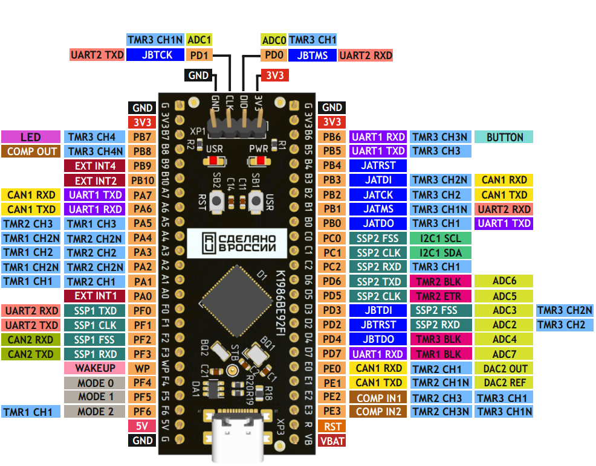

# Milandr K1986BE92FI-Mini
[К1986ВЕ92FI-Mini](https://ic.milandr.ru/products/programmno_otladochnye_sredstva/otladochnye_komplekty/k1986ve92fi-mini-otladochnaya-plata-mikrokontrollera/) - это малогабаритная отладочная плата с установленным микроконтроллером К1986ВЕ92FI (маркировка микросхемы: MDR1211FI).


## Распиновка
Ядро [Arduino_Core_Milandr](https://github.com/unsi9ned/Arduino_Core_Milandr) предполагает следующую распиновку платы:

```
                                         ♫     ♫
          PWM8                       PWM7| PWM6| PWM5              PWM4
           |                          |  |  |  |  |                 |
           | P37      P35   P33   P31 | P29 | P27 | P25   P23   P21 |
          P38 | P36    | P34 | P32 | P30 | P28 | P26 | P24 | P22 | P20
           |  |  |     |  |  |  |  |  |  |  |  |  |  |  |  |  |  |  |
     G 5V F6 F5 F4 WP F3 F2 F1 F0 A0 A1 A2 A3 A4 A5 A6 A7 B10B9 B8 B7 3V3 G
     |  |  |  |  |  |  |  |  |  |  |  |  |  |  |  |  |  |  |  |  |  |  |  |
   +------------------------------------------------------------------------+
   |                                                                        |
  ┌-----┐                                                                   |+-- G
  | USB |                                                                   |+-- SWCLK
  └-----┘                                                                   |+-- SWIO
   |                                                                        |+-- 3V
   +------------------------------------------------------------------------+
     |  |  |  |  |  |  |  |  |  |  |  |  |  |  |  |  |  |  |  |  |  |  |  |
    VB  R E3 E2 E1 E0 D7 D4 D2 D3 D5 D6 C2 C1 C0 B0 B1 B2 B3 B4 B5 B6 3V3 G
           |  |  |  |  |  |  |  |  |  |  |  |  |  |  |  |  |  |  |  |
          P0 P1 P2 P3 P4 P5 P6 P7 P8 P9 P10 | P12 | P14 | P16 | P18 |
           |  |        |  |  |  |  |  |  | P11   P13   P15   P17 | P19
           |  |       AN0 | AN2 | AN4 |  |              |        |
           |  |          AN1   AN3   AN5 |              |        |
           | PWM0                       PWM1           PWM2     PWM3
           ♫
```

| Пин Arduino | Пин MCU | Функция | PWM (~) | ADC | DAC | Tone (♫) |
|:---|:---|:---|:---|:---|:---|:---|
| D0 | PE3 | GPIO | — | — | — | Tone0 |
| D1 | PE2 | GPIO | PWM0 | — | — | — |
| D2 | PE1 | GPIO | — | — | — | — |
| D3 | PE0 | GPIO | — | — | DAC2 | — |
| D4 | PD7 | GPIO | — | A0 | — | — |
| D5 | PD4 | GPIO | — | A1 | — | — |
| D6 | PD2 | GPIO/SPI2_MISO | — | A2 | — | — |
| D7 | PD3 | GPIO/SPI2_SS | — | A3 | — | — |
| D8 | PD5 | GPIO/SPI2_SCK | — | A4 | — | — |
| D9 | PD6 | GPIO/SPI2_MOSI | — | A5 | — | — |
| D10 | PC2 | GPIO | PWM1 | — | — | — |
| D11 | PC1 | GPIO/I2C1_SDA | — | — | — | — |
| D12 | PC0 | GPIO/I2C1_SCL | — | — | — | — |
| D13 | PB0 | GPIO | — | — | — | — |
| D14 | PB1 | GPIO | — | — | — | — |
| D15 | PB2 | GPIO | PWM2 | — | — | — |
| D16 | PB3 | GPIO | — | — | — | — |
| D17 | PB4 | GPIO | — | — | — | — |
| D18 | PB5 | GPIO | PWM3 | — | — | — |
| D19 | PB6 | GPIO/BUTTON | — | — | — | — |
||||||||
| D20 | PB7 | GPIO/LED | PWM4 | — | — | — |
| D21 | PB8 | GPIO | — | — | — | — |
| D22 | PB9 | GPIO | — | — | — | — |
| D23 | PB10 | GPIO | — | — | — | — |
| D24 | PA7 | GPIO/SERIAL1_TX | — | — | — | — |
| D25 | PA6 | GPIO/SERIAL1_RX | — | — | — | — |
| D26 | PA5 | GPIO | PWM5 | — | — | — |
| D27 | PA4 | GPIO | — | — | — | Tone1 |
| D28 | PA3 | GPIO | PWM6 | — | — | — |
| D29 | PA2 | GPIO | — | — | — | Tone2 |
| D30 | PA1 | GPIO | PWM7 | — | — | — |
| D31 | PA0 | GPIO | — | — | — | — |
| D32 | PF0 | GPIO/SPI1_MOSI/SERIAL2_RX | — | — | — | — |
| D33 | PF1 | GPIO/SPI1_SCK/SERIAL2_TX | — | — | — | — |
| D34 | PF2 | GPIO/SPI1_SS | — | — | — | — |
| D35 | PF3 | GPIO/SPI1_MISO | — | — | — | — |
| D36 | PF4 | GPIO | — | — | — | — |
| D37 | PF5 | GPIO | — | — | — | — |
| D38 | PF6 | GPIO | PWM8 | — | — | — |

> Примечание 1: Использование функции `analogWrite` возможно только на пинах, имеющих функцию PWMn (D1, D10, D15, D18, D20, D26, D28, D30, D38), либо на пинах с функцией DACn (D3). Вызов функции `analogWrite` на пинах PWM задает коэффициент заполнения ШИМ (duty cycle). Функция `analogWrite` на пине DAC2 управляет аппаратным ЦАП и задает на выходе аналоговое напряжение в диапазоне 0...3.3 В

> Примечание 2: Использование функции `tone` возможно только на пинах, имеющих функцию Tone (D0, D27, D29). Реализация ядра позволяет одновременно выполнять функцию `tone` только на одном из выбранных пинов до тех пор, пока не будет вызвана функция `noTone` либо не истечет интервал времени `duration` (если этот параметр был передан в функцию `tone`)

> Примечание 3: Так как функции `tone` и `analogWrite` делят между собой ресурсы аппаратного таймера TIMER_2, то при вызове `tone` становится недоступной генерация PWM на пинах D1 и D30. Соответственно и при вызове функции `analogWrite` на пинах D1, D30 прекращает работу функция `tone` на пинах D0, D27, D29. Захват ресурсов таймера осуществляет та функция, которая была вызвана последней.

> Примечание 4: В качестве основного `Serial` используется модуль UART_1 (D24, D25)

> Примечание 5: В качестве основного `SPI` используется модуль SSP_1 (D32...D35)

> Примечание 6: Возможно чтение показаний встроенного датчика температуры с помощью функции `analogRead` на виртуальном пине AIN_TEMP (D39). Параметры  температурного  датчика  не  регламентируются.  В  зависимости  от необходимой  точности  может  быть  достаточно  провести  градуировку  в  двух – трех точках.  При  необходимости  более  точных  измерений  необходимо  построить градуировочную  таблицу.  Градуировка  производится  индивидуально  для  каждой микросхемы.

## Основные характеристики и ограничения
- **Прерывания:** Не поддерживаются аппаратные прерывания (EXT_INT1 - EXT_INT4) в связи с их ограниченным функционалом. Вместо этого реализована программная эмуляция внешних прерываний: опрос всех известных пинов D0...D38 по таймеру SysTick с периодом 1 мс. Там, где нужна быстрая реакция программы на внешние прерывания, используйте пожалуйста функции `NVIC_EnableIRQ()` и обработчики прерываний `EXT_INTn_IRQHandler()`, при условии, что есть возможность сброса прерываний внешнего устройства посредством отправки команд по SPI, I2C и т.д. В противном случае наличие активной 1 на входе EXT_INTn будет приводить к зацикливанию вызова обработчика `EXT_INTn_IRQHandler()` и как следствие все ресурсы CPU будут уходить только на обработку данного прерывания.
- **Тактирование:** Микроконтроллер тактируется от внешнего источника - кварцевого резонатора с частотой 8 МГц. Далее входная частота умножается с помощью аппаратного PLL до значение HCLK = 80 МГц. При наличии проблем с внешним кварцевым резонатором, микроконтроллер использует менее точный внутренний источник тактирование HSI = 8 МГЦ. При этом частота тактирования CPU по прежнему равна HCLK = 80 МГц.
- **ADC:** Разрядность АЦП всегда равна 12-бит. Программно эмулируется разрядность в диапазоне 10...12 бит (при разрядности 10 бит просто отбрасываются 2 младших бита измерений). Изменить разрешение АЦП можно с помощью функции `analogWriteResolution`. Частота дискретизации АЦП составляет 312,5 кГц. В качестве опорного источника напряжение используется напряжение питания AUCC. В данной версии ядра нет возможно выбрать другой источник опорного напряжения.
- **PWM:**  Разрядность таймеров, генерирующих ШИМ всегда равна 12-бит. Программно эмулируется разрядность в диапазоне 8...12 бит. Когда выбранная разрядность канала ШИМ меньше аппаратной, происходит автоматическо масштабирование устанавливаемого значения Duty Cycle (дополняется нужным количеством младших бит до 12-битного значения). Изменить разрядность аналогового выхода можно с помощью функции `analogWriteResolution`. Частота генерации ШИМ составляет 19531,25 Гц.
- **Tone:** Для генерации сигнала Tone используется аппаратный таймер TIMER_2, что налагает ограничение в использовании аналоговых выходов ШИМ D1 и D30 (см. Примечание 3). Частота сигнала Tone может быть установлена в диапазоне 0...65535 Гц, скважность сигнала всегда равна 2.
- **I2C:** Библиотека Wire позволяет использовать модуль I2C только в режиме Master, что связано с аппаратными ограничениями. Поддерживаемые скорости передачи данных: 100 кГц, 400 кГц, 1 МГц. Поддерживается только 7-битная адресация Slave-устройств на шине. Синхронный режим работы драйвера I2C
- **SPI:** Поддерживается 4 режима работы шины (MODE0...MODE3). Управление пином CS только программное (на уровне пользовательского кода `pinMode(CS_PIN, OUTPUT);`). Максимальная частота шины SPI - до 40 МГц. Текущая версия драйвера SPI работает в синхронном режиме.
- **UART:** Поддерживаются все стандартные режимы Serial. В текущей версии драйвера UART реализованы кольцевые буферы приема/передачи, позволяющие выполнять обмен данными асинхронно, не блокируя выполнение основной программы.
- **RTOS:** Данная реализация ядра не поддерживает режим многозадачности. Код выполняется в главном цикле `loop()`. Некоторые асинхронные операции достигаются посредством использования прерываний.
- **Память:** Максимальный размер кода ядра во Flash при использовании всех функции и библиотек составляет ~ 48 кБайт. Минимальный объем: ~ 8 кБайт (пример Blink).
- **Отладка и программирование:** В данной реализации ядра программирование и отладка кода возможна только посредством интерфейса SWD (пины PD0, PD1) и отладчика [CMSIS-DAP](https://youtu.be/eep67OBxDgY?si=9kgx_O3R5RbfFlXN)